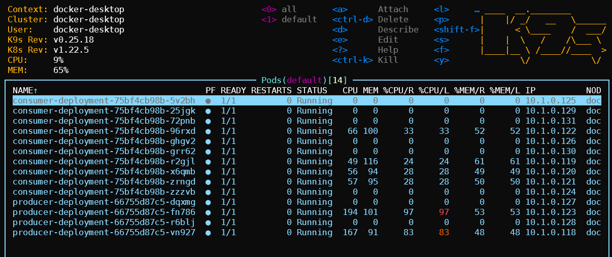
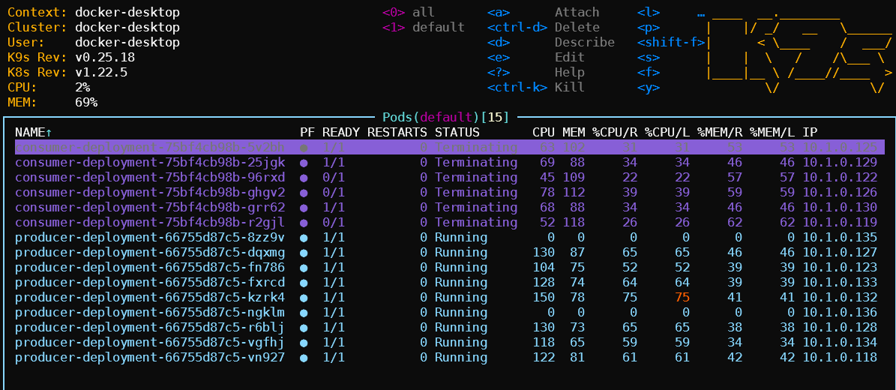
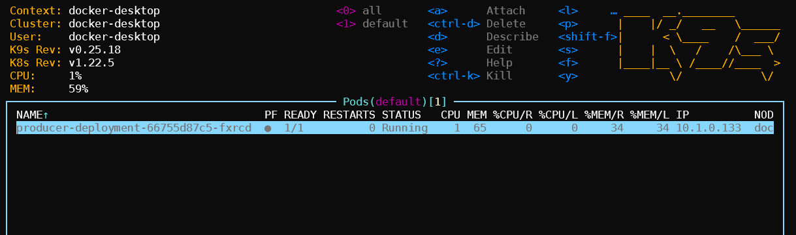

# Keda sample deployment

This repository was created to study the keda.sh project, using the schedule based on the consumer delay of the kafka topic. Automatically scaling deployment in kubernetes.

Some previous steps must be performed

1. [Kafka Install](kafka/install.md)
2. [Keda.sh Install](keda/install.md)
3. [Producer and Consumer deploy](deployments/readme.md)

## Producer

It's a .net core application that from a get http method {host}/process/{count}, publishes some random messages in the kafka topic.

## Consumer

is a quarkus application that consumes from the {fruits} queue, performs a role and returns it to another {fruits-buy} queue.

# Images
Under Load:

Cooldown:

After or Waiting Load:

# ToDo

Add Monitoring and get graphs